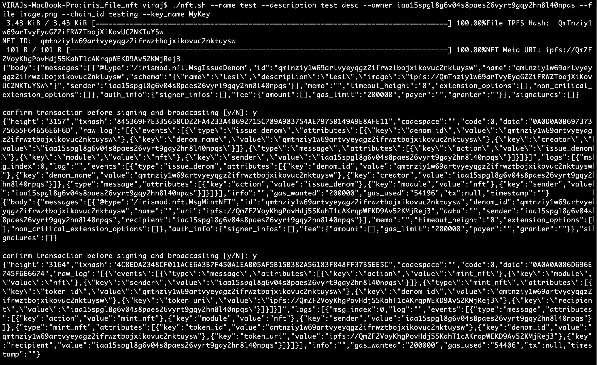
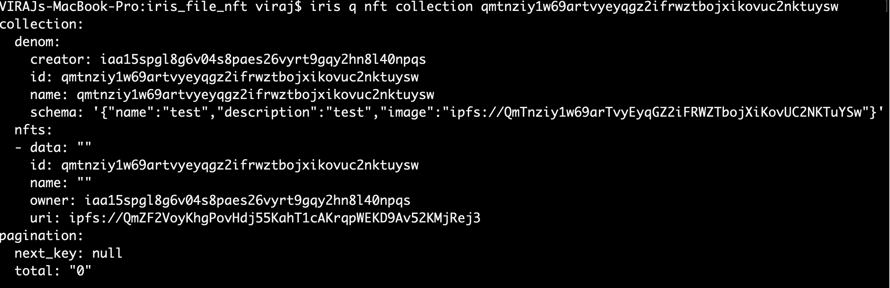

## Iris File NFT

Mint file based NFTs using IRISnet and IPFS


## Getting Started

1) Install Docker and Docker compose
   ```
   https://docs.docker.com/engine/install/#server
   https://docs.docker.com/compose/install/
   ```
   
   Install Go 1.15
   
   https://golang.org/dl/
   
   Once Go is installed then add the following to ~/.bashrc
   
   ```
   export GOPATH=$HOME/go
   export PATH="$GOPATH/bin:$PATH"
   ```
   
   Then run the following command
   ```
   source ~/.bashrc
   ```
   
2) Install Iris command line utility

   ```
   git clone --branch v1.0.1 https://github.com/irisnet/irishub
   cd irishub
   make install
   cd ..
   ```

3) Create iris key

   ```
   iris keys add MyKey
   ```
   
   Note down address and mnemonic from output
   
4) Start a local testnet chain

   ```
   iris init testing --chain-id=testing
   iris add-genesis-account $(iris keys show MyKey --address) 150000000uiris
   iris gentx MyKey 100000000uiris --chain-id=testing 
   iris collect-gentxs
   sed -i '' 's/stake/uiris/g' $HOME/.iris/config/genesis.json
   iris start
   ```
   
5) Clone iris_file_nft in a separate tab

   ```
   git clone https://github.com/viraja1/iris_file_nft.git
   cd iris_file_nft
   ```
   
6) Start IPFS container

   Install IPFS CLI - https://docs.ipfs.io/install/command-line/

   ```
   docker-compose up -d ipfs
   ipfs init
   ```
   
 7) Mint NFT from an image file using IRISnet and IPFS
 
    ```
    ./nft.sh --name test --description "test desc" --owner iaa15spgl8g6v04s8paes26vyrt9gqy2hn8l40npqs --file image.png --chain_id testing --key_name MyKey
    ```
    
    Replace iaa15spgl8g6v04s8paes26vyrt9gqy2hn8l40npqs with the address to which the NFT must be sent

## Screenshots



